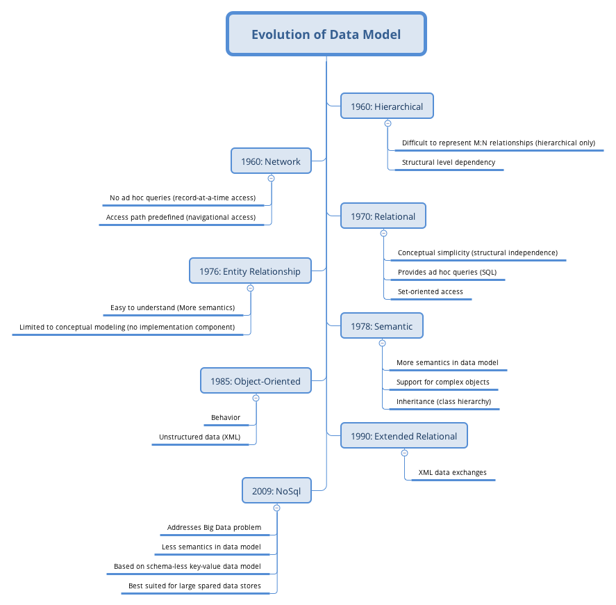
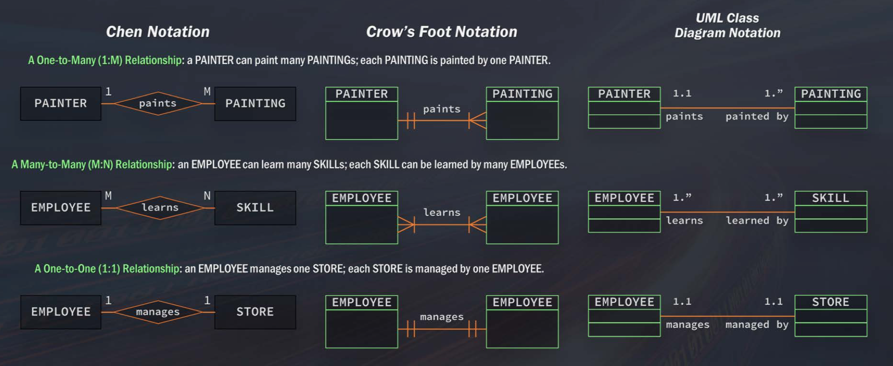

# Data Models and Diagrams

**Learning Objectives**

- Explain why thinking beforing coding is important
- Explain why it is important to understand how the data in a database relates to one another
- Describe what a databse is at its core
- Describe data models
- Define relational database system
- Discuss advent of relational databases in SQL

## Think before code

The reason why thinking beforing coding is importan is because you have to understand the structure of the data well to effectively write queries. Understanding your data means the following:

- Understand the business process or subject matter the data is modeled after
- Know the business rules
- Understand how your data is organized and structured in the table 

Before you start to write a query, think about:

- what is the problem you are trying to solve?
- what is the data you need to get?
- how does the data relate to each other?
- how does it interact? 
- what are some of the problems that you may want to solve with this data and need to be aware of?
- what are the types of joints or business processes in the data modeling?

This will really help you because not only will you get more accurate results, but also speed up the time it takes you to work and get things done.  If you start to think about what you're doing before you do it, you should hopefully also have less rework. 

Now what is a database and what is a table? 

> **Database**: A container (usually a file or set of files) to stre organized data; a set of related information

> **Tables**: A structured list of data or a specific type

A database is really a container that is usually a file or set of files and is used to organize and store all of the data. If you think of this in real world terms, It'd be like a filing system that has many cabinets along a wall. Within that system, within a database, we have tables, these tables are structured lists of data elements or specific data type. Going back to our analogy, you can think of this as maybe one of the cabinets within a whole wall of cabinets. Then if we dive further into the cabinet, into a table, what we find is we have columns and rows, which of course is what makes up a table. A table is made up of a series of individual columns, and then a row and a table is a record. Through tables, rows, and columns, ultimately throughout the database we have a mechanism to store and retrieve data. 

## What is data model?

Data model is what we use to organize information for multiple tables and how they relate to each other together. This helps tremendously in providing structure to the information in the system. Usually a data model represents a business process and it also helps you understand a business process. As a data scientist, you often need to work with a business person in understanding the data and how it fits together. But at the same time, the business person will learn a lot from the data modeller to better understand how their business actually works together by seeing the data and how it interacts with each other. 

The data model here is not predictive model which a data scientist often build. It is a way the tables are represented and organized in a database. One thing to remember is that a data model should always represent a real world problem as closely as possible. There are couple different types of models, and there has been an evolution of data models.

The evolution of data model traces back to 1960s. There's been hierarchical, network, relational, entity, relational somatic, and NoSql. 



Here we will briefly talk a little about the relational and NoSql. Because we are going to work a lot with relational model. If you are interested in learning more, there is material widely available on the internet and you can do your own research.

The benefits of a relational model are:

- simplify the connections between the data
- allow you to write queries (retrieve/update/write data) easily

NoSQL was part of the Big Data movement that you should have already heard about. It is a mechanism for storage and retrieval where it's not modeled in a tabular relational format. NoSQL was popular when big data and unstructured data first came out because you left it unstructured, but it's now started to soften a little bit, and more commonly referred to as Not Only SQL. One question to think about: does SQL really have a role still in the Big Data world, as new things start to come out like NoSQL and unstructured data? 

Next let's talk about the difference between relational and transactional databases. A **relational model** is a database design that shows the relationships between the different tables, optimizes querying data, makes it easy and intuitive to access the data. **Transactional model** is a more operational database. If you are in healthcare, for example, you may have a transactional database that is used to store all the claims information and then this information may not be stored in a great way for querying and using it for analysis. In fact, you may need to take and extract that transactional information from the database and move it into a relational model. 

Most of what we will be working with is the relational model. There are 3 building blocks for relational model:

1. Entities: a person, place, thing or event. These are very distinguishable, unique and distict. 
1. Attributes: characteristics of this entity.
1. Relationships: associations among different entities, can be one-to-many, many-to-many and one-to-one.

For example, Pioneer has a great corn seed product called P1197 which could be an entity. And then we have attributes that are characteristics of P1197, such as price, average yeilds, units sold, promotion programs. If you think of a one-to-many relationship, this could be P1197 has many promotion programs. When you think of a many-to-many relationship, this could be an example of many products to many different promotion programs. You may have one product that belongs to different programs or you may have a program that is available for  different products. Then, if you think of a one-to-one relationship, it could be one product has a unique price.

To understand these relationships between the tables a lot better, what's often used to depict this are ER diagrams. ER model is composed of entity types and specific relationships that can exist between instances of those entity types. These are usually displayed in a visual format and a relate represents a **relationship** between the tables. It often helps you to understand and represent a **business process** and it will show the **links** between these tables. The links are important when we join these tables. **Being able to look at this diagram and see how they relate to each other** is really important. 

We can use the **primary key** or **foreign key** to join tables. The primary key is a column or set of columns whose values uniquely identify every row in a table. Foreign key is one or more columns can be used together to identify a single row in another table. When we're looking at ER diagrams, which again is one of the ways you will start to think before you do, you'll look at maybe an ER diagram and understand what data elements you are trying to join together and how do you need to get them. But one of the things you need to understand is how to read this. We talked a little bit about relationships and the different relationships between a table. There is a different type of notation that explains the relationships. 

- Chen notation
- Crow's foot notation
- UML class diagram notation

The Chen notation uses `1:M` for a one-to-many relationship, and `M:N` for a many-to-many relationship and `1:1` for a one-to-one relationship. 

In Crow's foot notation, we have the train tracks which represent 1 and then the Crow's foot which represents many. 

In UML notation, we have a 1.1 which represents the concept of one and 1.* which represents the concept of many. 



Get familar with the different notations since you'll be looking at ER diagrams quite frequently and you'll need to understand these notations when reading ER diagrams so you can understand how you're going to write your query and join the table together or even to find out what's listed in the table. Having a good understanding of why the data is structured in a particular way and how to read the ER diagrams is necessary for writing queries and ensuring accurate results. 

## Retrive data with `SELECT`

The majority of what data scientists are doing with SQL is retrieving data. To get started, the first statement to learn is `SELECT`. There are two pieces of information to specify in `SELECT` statement: what to select and where it is from. It will be straightforward with an example.

```sql
SELECT prod_name
FROM Products;
```

```pre
prod_name
Shampoo
Toothpaste
Deodorant
Toothbrush
```

Ihis example selects product name which a column from the table (`prod_name`). Then you need to specify where to get it from. Here it is from a table named `Products`. The output of this is then going to look like the column listed below. Which it has a column product name and then all of the list of products. We have shampoo, toothpaste, deodorant, and toothbrush. If you want to retrieve more than a single column from a table, then what you need to add the names of the individual columns separated with a comma:

```sql
SELECT prod_name, prod_id, prod_price
FROM Products;
```

Request all columns by using the asterisk (`*`) wildcard character instead of column names:

```sql
SELECT *
FROM Products;
```

This is going to go ahead and grab everything from the Products table, each individual column, and put it into your output. 

A lot of times we may want get a view of the table to understand what data is in there without pulling all the records. In this case, we may do a "`SELECT *`". But if there are 5 million records in it, we just need a tiny sample of that. In this case, we can use `LIMIT` to limit the results. 

```sql
SELECT prod_name
FROM Products
LIMIT 5;
```

Here is an example of how different RDMS differ in syntax:


If you are using SQLite and understand it's `LIMIT 5`. When switch over to a DB2 system, you can easily Google in terms of the syntax in DB2. 

